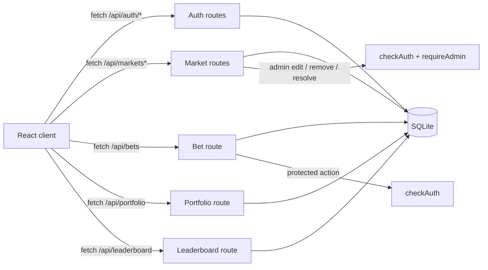
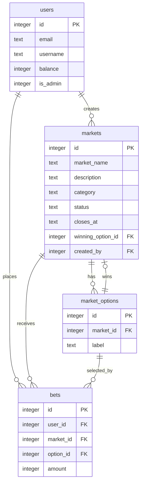

# BruinBet

UCLA's prediction market for campus events, sports, academics, and student life.

## Features

- Public market feed backed by SQLite data.
- Market search by name, description, or category.
- UCLA email registration and login.
- JWT-protected backend routes.
- Practice balance for each user.
- Market detail data with options, liquidity, and bet counts.
- Admin-protected market creation.
- Admin market editing for markets created by the current admin.
- Admin market removal with full bet refunds when a listing has no outcome, plus cleanup for resolved listings.
- Authenticated bet placement with balance deduction.
- Portfolio and leaderboard views.
- Admin market resolution with pooled payouts.
- Past market section for expired and resolved listings.
- Prediction-market-style cards with live probability bars, outcome rows, pool/bet stats, and current leading side.
- Bet ticket modal with quick stake buttons and estimated payout based on the current market pool.
- Admin navigation menu that groups market-management actions without crowding the top bar.

## Tech Stack

- React and Vite frontend in `client/`.
- Express backend in `server/` and `routes/`.
- SQLite database initialized from `server/db/schema.sql`.
- JWT authentication with `jsonwebtoken`.
- Password hashing with `bcrypt`.

## Local Setup

Install root dependencies:

```bash
npm install
```

Install server dependencies:

```bash
cd server
npm install
```

Install client dependencies:

```bash
cd client
npm install
```

Create `server/.env`:

```bash
JWT_SECRET=replace_this_with_a_local_secret
PORT=5001
```

## Running Tests
- From the repository root, run the Playwright end-to-end tests:

```bash
npx playwright test
```

- To run a single test file (example):

```bash
npx playwright test tests/end_to_end_auth.spec.js
```

- Notes:
  - Ensure the server is running (e.g., `cd server && npm run dev`) and that required environment variables are set. See `admin_login.env` for test credentials used by the Playwright specs.
  - Playwright configuration is in `playwright.config.js` at the repo root.

You can copy the required keys from `server/.env.example`.

Optional client environment variable:

```bash
VITE_API_BASE_URL=http://localhost:5001
```

If `VITE_API_BASE_URL` is not set, the frontend defaults to `http://localhost:5001`.

## Running Locally

Seed the database:

```bash
cd server
npm run seed
```

Seed sample bets:

```bash
cd server
npm run seed:bets
```

By default this seeds bets under `admin@ucla.edu`. You can specify an email (replace `<your-email>`):

```bash
cd server
npm run seed:bets -- --email=<your-email>@ucla.edu
```

Start the backend:

```bash
cd server
npm run dev
```

Start the frontend in a separate terminal:

```bash
cd client
npm run dev
```

The backend runs on `http://localhost:5001` by default. Vite will print the frontend URL in the terminal, usually `http://localhost:5173`.

## Current API

| Method   | Endpoint                               | Description                                                    |
| -------- | -------------------------------------- | -------------------------------------------------------------- |
| `GET`    | `/api/health`                          | Health check                                                   |
| `POST`   | `/api/auth/register`                   | Register with a UCLA email                                     |
| `POST`   | `/api/auth/login`                      | Log in and receive a JWT                                       |
| `GET`    | `/api/markets?status=open&search=ucla` | List markets with optional status and search filters           |
| `GET`    | `/api/markets/:id`                     | Get one market with options and summary stats                  |
| `POST`   | `/api/markets`                         | Admin-protected market creation                                |
| `PATCH`  | `/api/markets/:id`                     | Admin-protected edits for markets created by the current admin |
| `DELETE` | `/api/markets/:id`                     | Admin-protected market removal with bet refunds                |
| `POST`   | `/api/markets/:id/resolve`             | Admin-protected market resolution and payout                   |
| `POST`   | `/api/bets`                            | Place an authenticated bet                                     |
| `GET`    | `/api/portfolio`                       | Get the authenticated user's positions                         |
| `GET`    | `/api/leaderboard`                     | Get ranked users by balance and betting activity               |

### Auth Notes

Registration requires:

```json
{
  "email": "user@g.ucla.edu",
  "password": "at-least-8-characters",
  "username": "User Name"
}
```

Successful auth responses include a JWT and a safe user object:

```json
{
  "token": "jwt-token",
  "user": {
    "id": 1,
    "email": "user@g.ucla.edu",
    "username": "User Name",
    "balance": 10000,
    "is_admin": 0
  }
}
```

Protected routes expect an authorization header:

```http
Authorization: Bearer jwt-token
```

### Market Notes

`GET /api/markets` accepts:

- `status`: defaults to `open`; supported computed values are `open`, `expired`, and `closed`.
- `search`: optional case-insensitive search over market name, description, and category.

Market list responses include summary fields:

- `option_count`
- `total_liquidity`
- `bet_count`

`GET /api/markets/:id` returns the selected market plus its options. Each option includes its own liquidity and bet count.

`POST /api/markets/:id/resolve` accepts a winning option and distributes the market pool proportionally among users who bet on that option:

```json
{
  "winning_option_id": 1
}
```

`DELETE /api/markets/:id` removes a listing created by the current admin. If the market is unresolved, every bet on that market is refunded before deletion. If the market is already resolved, the listing and its bets are deleted without changing balances because payouts have already been applied.

### UI Notes

Market cards show the current pool distribution for each outcome. The "Leading" label means the outcome with the largest share of the current betting pool; it is not an official result.

The bet modal estimates payout before submission using the same pooled payout idea as resolution: the entered stake is compared against the selected option pool, then applied to the total market pool after the new stake. This estimate is informational and can change as other users place bets.

Admin-only navigation is grouped under an `Admin` hover menu to keep the top bar usable on narrower screens.

## Architecture Diagrams

### Client-Server Request Flow



The React app calls Express API routes with `fetch`. Protected actions send a JWT in the `Authorization` header; admin-only market creation, edits, removal, and resolution also pass through `requireAdmin`.

### Database Entity Relationship



Balances are debited when users place bets. When a market is resolved, winners split the full market pot proportionally to their share of the winning option pool. When an unresolved listing is removed, all bets on that listing are refunded; when a resolved listing is removed, prior payouts are left unchanged.

## Development Workflow

Useful commands:

```bash
cd server && npm run seed
cd server && npm run seed:bets
cd server && npm run dev
cd client && npm run dev
cd client && npm run lint
cd client && npm run build
```

Before opening a pull request, run the client lint/build checks and confirm the server starts with your local `server/.env`.

## Testing

The client currently has linting and production build checks:

```bash
cd client
npm run lint
npm run build
```

Automated end-to-end tests are planned with Playwright before the final presentation.

## Project Notes

- The UI keeps the UCLA blue/gold colorway while using prediction-market-style layout patterns for cards, outcome rows, probability bars, and the trade ticket.
- The app background is applied at the document level so browser overscroll does not reveal a mismatched page color.

- The SQLite database file is generated locally and ignored by git.
- New users start with a practice balance of `10000`.
- Registration accepts `@ucla.edu` and `@g.ucla.edu` addresses.
- Optional stretch features are tracked in `updated_scheduled_tasks.md`.
